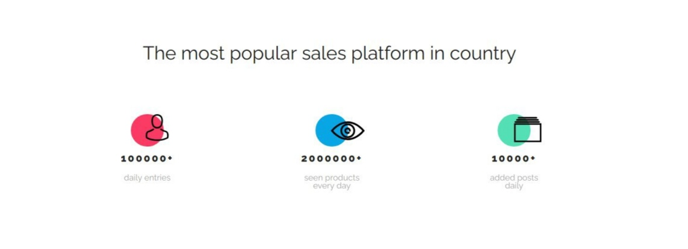
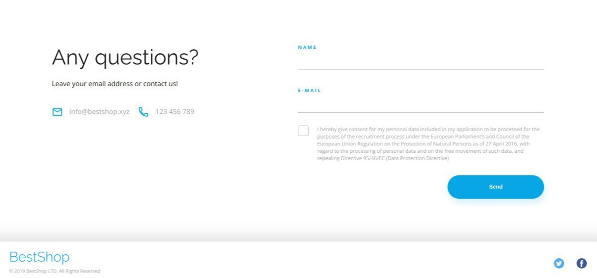

# About and preview 

A simple React project called "BestShop" which consists of four main parts.

1. Header

2. Statistic

3. Pricing

4. Contact

# Getting Started with Create React App

This project was bootstrapped with [Create React App](https://github.com/facebook/create-react-app).

# Used packages
* [react-router](https://www.npmjs.com/package/react-router)

# How to use
If you want to clone then: 
- clone repo to your computer
- run `npm -i`
- run npm start
