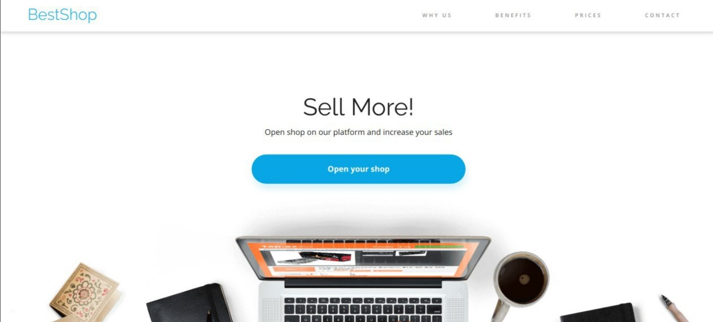
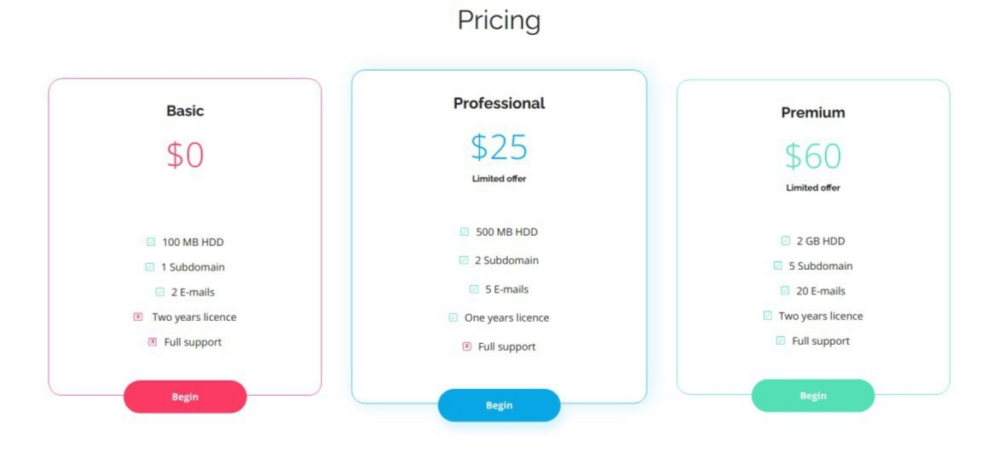

# About and preview 

A simple React project called "BestShop" which consists of four main parts.

1. Header

The first part of the website that the user sees after opening the page. It contains the navigation menu and the first section of the page.

2. Statistic

Block of website statistics.

3. Pricing

There are three types of package subscriptions available on the website. Each of them has different components, depending on what the price is.

4. Contact

The telephone number, email address and contact form are in this block. In the bottom corner there are links to social media.

# Getting Started with Create React App

This project was bootstrapped with [Create React App](https://github.com/facebook/create-react-app).

# Used packages
* [react-router](https://www.npmjs.com/package/react-router)

# How to use
If you want to clone then: 
- clone repo to your computer
- run `npm -i`
- run npm start
